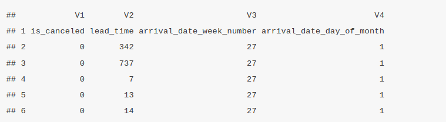

# Data Importing and Exporting 
## Introduction to Data Importing 
Loading data in R can be very stressful since every file format has a function to import the data. However, it can be very simple when well explained. Here are some of the most commonly used data file formats R and their importation;-

- Comma Separated Value(CSV - .csv) files imported by `read.csv("filepath")` function
- Excel(.xlsx) files loaded by `read_excel("filepath")` function`
- XML(.xml) imported by `read.xml("filepath")` function` 
- Javascript Object Notation (JSON) by  `read.json("filepath")`

There are more data files with different formats that can be used in R, their importation will be explained later in the course. 

## Demonstration of Data Importing
- **Importing a CSV file in R**

There are different formats to import a csv file in R. We will use the `read.csv()` and `read.delim()` which are functions from the baseR. 

Reading a csv file using `read.csv()` function. 
```
# read the csv file to the data frame 
df <- read.csv('data/hotel_bookings_clean.csv')
head(df) # show first few rows 
```


Now, lets read the same csv file with `read.delim()` function. Remember to add "," as the separator. `sep=","`. 
```
# Read the csv file 
df <- read.delim("data/hotel_bookings_clean.csv", sep = ",")
head(df) # show the first few rows
```


Lets also read the csv file using the `read.table()` function(note the `sep=","` argument);
```
df <- read.table("data/hotel_bookings_clean.csv", sep = ",")
head(df)
```


The `read_csv()` function is one more way to read a csv file. This function comes from the `readr` package that is installed by;
```
install.packages("readr")
```

and the library can be imported by;
```{r}
library(readr)
```

Lets read a csv file using the `read_csv()`(note the '_' instead of a '.') from the `readr` library. 
```{r}
df <- read_csv("data/hotel_bookings_clean.csv", show_col_types = FALSE)
head(df)
```

`read.csv()`, `read.delim()`, `read.table()` and `read_csv()` are the functions used to read CSV files in R. 

- **Importing Excel file in R**

In this section we will read the HR employee data for descriptive and inferential analytics. We will use the `read_excel` from the `readxl` package. It can be imported by;
```{r}
library(readxl)
```

Let's load the excel data into R data frame. 
```{r}
df <- read_excel("data/HR_Employee_Data.xlsx")
head(df)
```

If they are multiple worksheets in the excel, the read_excel has an argument `sheet` for sheet number(By default, sheet 1 is loaded. Lets load the first sheet. 
```{r}
df_sheet1 <- read_excel("data/HR_Employee_Data.xlsx", sheet=1)
head(df_sheet1)
```

A detail documentation of the `read_excel()` function can be found [here](https://www.rdocumentation.org/packages/readxl/versions/1.4.1/topics/read_excel)

## Introduction to Data Exporting
After data wrangling, manipulation and processing, the end product(processed data) can be saved for further use. The data can also be share to others. R has several functions to write the processed data locally into either CSV, Excel, text or other file formats. 

Lets go through a brief overview of how data can be exported in R; 

i. CSV files are exported by `write.csv()` function.
ii. The excel files are written locally by `write.xlsx()` function. Remember to install the `xlsx` package before exporting data to excel. The package is installed by
```
install.packages("xlsx")
```

iii. `writeLines()` is used to write vectors to a text file. 
iv. The `write.table()` function is more of a general function that different types of files for example TSV, CSV and text files. 

Lets create a small data frame and demonstrate how these functions work.
```{r}
# Sample data frame
df <- data.frame(
  Name = c("Alice", "Bob", "Charlie"),
  Age = c(25, 30, 35),
  Salary = c(50000, 60000, 70000)
)

df
```
The data frame will be exported to csv by `write.csv(data_frame, file=filepath)`. Lets do it; 

```
write.csv(df, file="data/sample_data.csv")
```

Then export the same data frame `df` to an excel file using the the command `write.xlsx(data_frame, file=filepath)`
```
library(xlsx)
write.xlsx(df, file="data/sample_data.xlsx")
```

Also, the `openxlsx` package can be used to export data to excel. The package is installed by;
```
install.packages("openxlsx")
```
and the file is written by the same `write.xlsx()` function. 

Lets repeat the process of exporting using the `write.xlsx()` function from the `openxlsx` library.
```
library(openxlsx)
write.xlsx(df, file="data/sample_data_2.xlsx")
```

Finally, lets export the data frame using the `write.table()` function. 
```
# Export to a text file with space as a delimiter
write.table(df, file = "data/sample_data.txt", sep = " ", row.names = FALSE, quote = FALSE)
```

The same data frame can be converted to a data vector and loaded to a text file using the `writeLines(data_vector, filepath)`. 

Lets convert the data frame to a data vector and show the output. 
```{r}
# Convert data frame to a character vector
df_vector <- apply(df, 1, function(row) paste(row, collapse = " "))

df_vector
```

Export the file
```
# Write the character vector to a text file
writeLines(data_vector, "data/sample_data_with_writeLines.txt")
```

## Practical Exercise
Down the house prices regression data set from [here](https://www.kaggle.com/datasets/prokshitha/home-value-insights) and do the following;

i. Read the CSV file into a `data.frame` and give it a variable name `housePricesDF`
ii. Write the `data.frame` into an Excel file locally.


## Solutions
### Practical Exercise
Down the house prices regression data set from [here](https://www.kaggle.com/datasets/prokshitha/home-value-insights) and do the following;

i. Read the CSV file into a `data.frame` and give it a variable name `housePricesDF`
ii. Write the `data.frame` into an Excel file locally.

```{r}
# i. Read the CSV file into a `data.frame` and give it a variable name `housePricesDF`
housePricesDF <- read.csv("data/house_price_regression_dataset.csv")

# ii. Write the `data.frame` into an Excel file locally
write.csv(housePricesDF, "data/saved_data/house_price_regression_dataset.csv")
```