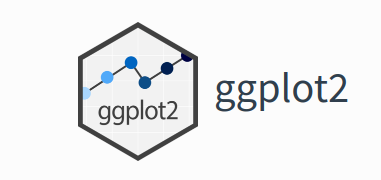

# Data Visualization
## Basic Data Visualization
### Introduction to ggplot2


This is package designed for data visualization. It provides a powerful and flexible framework for creating complex and aesthetically pleasing visualizations, allowing users to layer various components such as axes, scales, colors, and `geoms` to create detailed and customizable plots. 

The package is said that it implements the principle of "Grammar of Graphics". The "Grammar of Graphics" is a conceptual framework for creating graphs by Leland Wilkinson. The process of creating graphs is broken into fundamental components. This allows structure and flexible approach in data visualization. The plots are constructed by a layered approach by implementing these concepts step by step; data, aesthetics(`aes`), geometrics(`geoms`), statistical transformations (`stats`), scales, cordinates and facets.  

The package is also under the `tidyverse` package but can be installed by
```
install.packages("ggplot2")
```
Once the package is installed, it can be loaded by
```
library(ggplot2)
```

There are 5 key steps in plotting in ggplot;
<p>
  1.**The Setup** - Read the data set, define x and y axis 
  
  2. **The Labels** - Title, X and Y axis labels 
  
  3. **The Theme** - Default, Black and White, colored etc. 
  
  4. **The Facets** - Individual Graphs for each group in data with exactly same range
  
  5. **The Layers or geoms** - The actual plot type - e.g Bar plot, Box plot, Violin plot etc. 
</p>

Here is an example of a layered approach in creating charts by applying the "Grammar of Graphics". 

```{r}
library(ggplot2)

# Sample data
df <- data.frame(
  x = rnorm(100),
  y = rnorm(100),
  category = sample(c("A", "B"), 100, replace = TRUE)
)

# Creating a scatter plot
ggplot(df, # data
       aes(x = x, y = y, color = category)) + #aesthetics
  geom_point() + #geometrics
  labs(title = "Scatter Plot Example", x = "X-Axis", y = "Y-Axis") +
  theme_minimal()
```

#### Creating Basic Plots
- **Scatter Plots**  

Scatter plot is used to show a numerical relationship between two or more variables for instance height versus weight of footballers. It is also used to detect correlation, the increase in one variable can lead to increase/decrease of another variable. Furthermore scatter plots are used to detect outliers, values that appear out of the general patterns of other data points is said to be an outlier in this case. However, scatter plots is not suitable when working with categorical data especially when only two variables are to be analyzed.

Lets create a basic scatter plot to compare height and weight;-

```{r}
#Prepare a Sample data
df <- data.frame(
  height = c(150, 160, 170, 180, 190),
  weight = c(50, 60, 70, 80, 90)
)

# Creating a basic scatter plot
ggplot(df, # data
       aes(x = height, y = weight)) + # aesthetics
  geom_point() 
```
To make the chart more informative, titles and labels are added. 

```{r}
# Creating a basic scatter plot
ggplot(df, # data
       aes(x = height, y = weight)) + # aesthetics
  geom_point() +
  labs(title = "Height vs. Weight", x = "Height (cm)", y = "Weight (kg)") +
  theme_minimal()

```

Lets explain the chart step by step;- 

- `ggplot(df, aes(x = height, y = weight))`: Initializes the ggplot object, specifying the data frame (`df`) and mapping the `height` variable to the x-axis and the `weight` variable to the y-axis using the `aes()` function.
- `geom_point()`: Creates the scatter plots by adding dots to the chart
- `labs()`: Adds the title and the axis labels to the chart. 
- `theme_minimal()`: Applies a minimal theme to the plot for a minimalist and clean appearance.

<span style="color: green;">**Practical exercise**</span> 

Solve the questions below;

i. Using the `"mtcars"` inbuilt data set, plot a scatter chart to visualize the relationship between `mpg` (miles per gallon) and `hp` (horsepower). Label the axes appropriately. **Hint**: the data set can be loaded by `data("mtcars")` command.
ii. Using the `airquality` data set, plot a scatter plot to show the relationship between `Wind` and `Temp`. **Hint**: the data set can be loaded by `data("airquality")` command. 

<span style="color: brown;">**Solution**</span> 

- **Bar Charts**

Bar charts are used to represent both categorical and numeric data in form of rectangular bars. The length/height of each category represents its numeric value. It may corresponds to either length, count, age or any other numerical value. Bar charts are used when;- 

i. Comparing categorical data
ii. Visualizing summarized data for instance aggregated sum, average or any other summary statistics. 
iii. Showing frequency or count for instance representing the number of products sold per each category. 
iv. Ranking data. Bar charts can effectively represents ranks especially in descending/ascending order for instance ranking the life expectancy of different countries. 
v. Other type of complex bar charts like stacked bar charts can be used to compare part-to-whole relationships. 

There are many more uses of bar charts however there are some use cases where bar charts are not preferred like when working with continuous data, scatter and line charts are more befitting. Also, bar charts are not appropriate where data has too many categories, heatmaps will do better. 

To create a simple bar chart using ggplot2, we use `geom_bar` to define thats its a bar chart.

```{r}
# Sample data
df <- data.frame(
  category = c("A", "B", "C", "D"),
  value = c(23, 17, 35, 10)
)

## The data set above will be used to create a bar chart
# Creating a bar chart
ggplot(df, aes(x = category, y = value)) +
  geom_bar(stat = "identity") +
  labs(title = "Value by Category", x = "Category", y = "Value") +
  theme_minimal()
```


<span style="color: green;">**Practical exercise**</span> 

Using the `mtcars` data set, create a bar plot to visualize the number of cars for each unique number of cylinders (`cyl`) in the mtcars data set. Label the bars with the appropriate cylinder categories and provide axis labels for clarity.

<span style="color: brown;">**Solution**</span> 


- **Histograms**

Histogram is visually similar to the bar chart however it is used show frequency and distribution across a list-like data set(vectors, lists, sets, arrays, etc) that stores continuous numeric values. The count of observation within a certain range of values are displayed. 

Lets create a vector of random 100 ages and plot the data to a histogram.

```{r}
# Generate random 1000 ages between 0 and 100
set.seed(42)
ages <- sample(0:100, 1000, replace = TRUE)

# Create a data frame to use with ggplot
age_data <- data.frame(Age = ages)

# PLOTTING
# Create the histogram using ggplot
ggplot(age_data, aes(x = Age)) +
  geom_histogram(binwidth = 5, fill = "blue", color = "black") +
  labs(title = "Histogram of Randomly Generated Ages", x = "Age", y = "Frequency") +
  theme_minimal()
```

The bins are groups of ages ranging 5 years. 

<span style="color: green;">**Practical exercise**</span> 

Using the `rivers` in built R data set, plot a histogram to visualize the distribution of rovers length. **Hint**: The data set is loaded by the command `data("rivers")`. 

<span style="color: brown;">**Solution**</span> 

#### Customizing plots
- **Themes**

Themes in `ggplot2` control the overall appearance of the plot for instance the grid line, font style, background color etc. To clearly explain the `theme` concept we will create a sample data set and plot it. The theme will be altered to show the changes in the appearance. 

Create a data set and plot a basic bar plot from `ggplot2`
```{r}
# Sample data
df <- data.frame(
  category = c("A", "B", "C", "D"),
  value = c(23, 17, 35, 10)
)

# Plot a basic bar chart
# Create a basic bar plot
ggplot(df, aes(x = category, y = value)) +
  geom_bar(stat = "identity")
```

Lets apply some built-in themes from `ggplot`. In this case, we will use the `theme_minimal()`. 
```{r}
# Bar plot with theme_minimal
ggplot(df, aes(x = category, y = value)) +
  geom_bar(stat = "identity") +
  theme_minimal()
```
The `theme_minimal()` removes background colors, extra gridlines and axes' tickers to give the a chart a clean look. 

Now, lets try with the `theme_classic()`
```{r}
# Bar plot with theme_classic
ggplot(df, aes(x = category, y = value)) +
  geom_bar(stat = "identity") +
  theme_classic()
```

The `theme_classic()` gives the bar plot a clear white background, black borderline with raised 0 point on the axes and bars. 

The third theme in this course is the `theme_light()`. Lets try it with the same data set. 
```{r}
# Bar plot with theme_light
ggplot(df, aes(x = category, y = value)) +
  geom_bar(stat = "identity") +
  theme_light()
```

The `theme_light()` is gives grey gridlines, grey borderline and raised bars(not touching the axes).

The last theme in this list is the `theme_dark()`. Lets try it below here;
```{r}
# Bar plot with theme_dark
ggplot(df, aes(x = category, y = value)) +
  geom_bar(stat = "identity") +
  theme_dark()
```
The `theme_dark()` is a clear opposite of `theme_light` as it produces a plot with a dark grid lines. 

There are more themes provided in `ggplot2` like `theme_bw()`

<span style="color: green;">**Practical exercise**</span>

Using the `mtcars` data set, create a bar plot to visualize the number of cars for each unique number of cylinders (`cyl`) in the mtcars data set. Apply different themes to the bar plot.

<span style="color: brown;">**Solution**</span> 

- **Labels and Titles**

The appearance of the charts can be made more appealing and informative by adding labels and titles. This can be achieved adding the function `labs` to a ready plot. 

Lets plot the same bar chart as above and add more information with labels; 
```{r}
# Create a basic bar plot
p <- ggplot(df, aes(x = category, y = value)) +
  geom_bar(stat = "identity")

p # Show the plot
```

The above chart is stored in a variable `p`. Lets add/modify the labels and titles using the `labs()` function. 
```{r}
# Bar plot with title, axis labels, and caption
p + labs(
  title = "Bar Plot of Categories",
  subtitle = "Values by Category",
  x = "Category",
  y = "Value",
  caption = "Source: Sample Data"
)

# Remember `p` is the bar plot
```

The bar plot is more informative now. Lets make the chart more appealing by modifying the appearance of the labels using the `theme()` function along with the `element_text()` function. 
```{r}
# Bar plot with customized title and labels
p + labs(
  title = "Bar Plot of Categories",
  subtitle = "Values by Category",
  x = "Category",
  y = "Value",
  caption = "Source: Sample Data"
) +
  theme(
    plot.title = element_text(hjust = 0.5, face = "bold", size = 16),
    plot.subtitle = element_text(hjust = 0.5, size = 14),
    axis.title.x = element_text(face = "italic", size = 12),
    axis.title.y = element_text(face = "italic", size = 12),
    plot.caption = element_text(hjust = 0, face = "italic", size = 10)
  )
```

<span style="color: green;">**Practical exercise**</span>

Using the `mtcars` data set, create a bar plot to visualize the number of cars for each unique number of cylinders (`cyl`) in the mtcars data set. Add `x`, `y` axes labels and titles to the plot. 

<span style="color: brown;">**Solution**</span> 

- **Color and aesthetics**

The general aesthetics are essential when presenting the analysis results. They enhance the visual appearance of the charts. It also allows the users/analyst to distinguish different properties/categories in a variable. They include; color, size and shape.

Lets plot a simple bar chart and add a flavor of aesthetics. 
```{r}
# Sample data with an additional variable. Modified the original one
df <- data.frame(
  category = c("A", "B", "C", "D"),
  value = c(23, 17, 35, 10),
  group = c("G1", "G2", "G1", "G2")
)


# Bar plot with mapped color, size, and shape
ggplot(df, aes(x = category, y = value, color = group, size = value, shape = group)) +
  geom_point()
```

Lets break down the scatter plot on how aesthetics are applied. 

i. `color = group`: Maps the group variable to the color of the points. Each group will have a different color.
ii. `size = value`: Maps the value variable to the size of the points. Points with higher values will be larger.
iii. `shape = group`: Maps the group variable to the shape of the points. Different groups will have different shapes.

Above there, the color was selected automatically by R. It can also be customized to fit our taste. Lets do a bit of color customization.
```{r}
# Customizing colors manually
ggplot(df, aes(x = category, y = value, color = group)) +
  geom_point(size = 5) +
  scale_color_manual(values = c("G1" = "blue", "G2" = "red"))
```

The `scale_color_manual()` function allows you to manually set the colors for each level of the group variable. In this case, G1 is set to blue and G2 to red.

<span style="color: green;">**Practical exercise**</span>

Using the `mtcars` data set, create a bar plot to visualize the number of cars for each unique number of cylinders (`cyl`) in the mtcars data set. Play with different foreground and background colors to come up with the best looking plot. 

<span style="color: brown;">**Solution**</span> 

## Advanced Data Visualization
### Creating Complex Visualizations
- **Boxplots**

Box plot is a type of chart that uses boxes and lines to show distributions of one or more groups of a continuous numeric data. They provide a high-level information at a glance for instance the data symmetry, skew and variance. They can also be used to show outliers within a data set. This is the only chart that can effectively give the measure of spread and central tendency(median, quartiles and range). 

Lets plot a simple boxplot for the age of employees from the IBM Human Resource Analytics data; The data can be downloaded from [here](https://www.kaggle.com/code/faressayah/ibm-hr-analytics-employee-attrition-performance/input)
```{r}
df <- read.csv("data/HR-Employee-Attrition.csv")

# Plot a boxplot
ggplot(df, aes(y=Age))+
  geom_boxplot(fill="black")
```

The upper quartile for the employees' age is 43(Q3) while the lower quartile(Q1) is 30.The median age is approximately 36. There are no outliers in the dataset. Lets compare the distribution of ages between male and female employees; (The `x` argument will be introduced in `aes()` function)
```{r}
# Plot a boxplot
ggplot(df, aes(y=Age, x=Gender))+
  geom_boxplot(fill=c("pink", "lightblue"))
```
The female employee have an older working population than the male counterparts with a median age of approximately 36 and 35 respectively. 

The distance between Q3 and Q1 (in this case the height of the box) is know as the Interquartile Range(IQR). 

The above boxplots are vertical, they can be shifted to horizontal by interchanging the `y` and `x` argument in the function `aes()`. Lets do it;
```{r}
# Plot a horizontal boxplot 
ggplot(df, aes(x=Age, y=Gender))+
  geom_boxplot(fill=c("pink", "lightblue"))
```

Lets add a few customization to make the graph more informative and visually appealing
```{r}
# BOXPLOT 
ggplot(df, aes(x=Age, y=Gender))+
  geom_boxplot(fill=c("pink", "lightblue"))+
  theme_dark() + 
  labs(
  title = "IBM HR Analytics",
  subtitle = "Boxplots of Employees' age by Gender",
  x = "Age",
  y = "Gender",
  caption = "Source: Kaggle"
) +
  theme(
    plot.title = element_text(hjust = 0.5, face = "bold", size = 16),
    plot.subtitle = element_text(hjust = 0.5, size = 14),
    axis.title.x = element_text(face = "italic", size = 12),
    axis.title.y = element_text(face = "italic", size = 12),
    plot.caption = element_text(hjust = 0, face = "italic", size = 10)
  )
  
```

<span style="color: green;">**Practical exercise**</span>

Load the inbuilt `ToothGrowth` data set and create a boxplot to compare the distribution of tooth length (`len`) across the different dose levels (`dose`) of Vitamin C in the `ToothGrowth` data set. Make sure to label the axes and title the plot appropriately.

<span style="color: brown;">**Solution**</span> 

- **Violin Plots**

An alternative to the boxplot is the violin plot. The violin plot addresses the issue of distribution. It shows the distribution curve unlike the boxplot and histogram. 

To demonstrate this, lets visualize the distribution of employees age using a violin plot. 
```{r}
# VIOLINE PLOT 
ggplot(df, aes(x=Age, y=""))+
  geom_violin(fill = "skyblue", color = "darkblue")
```

<span style="color: green;">**Practical exercise**</span>

Using the same `ToothGrowth` data set and create a violin plot to compare the distribution of tooth length (`len`) across the different dose levels (`dose`) of Vitamin C in the `ToothGrowth` data set. Make sure to label the axes and title the plot appropriately.

<span style="color: brown;">**Solution**</span> 

- **Facet Grids**

`ggplot2` has a functionality that enables creating multiple plots at once on the same chart. This concept is referred to as faceting. This use full especially when comparing two populations characteristics like distributions. There are two main functions that are used by statisticians; `facet_wrap()` and `facet_grid()`. 

i. `facet_wrap()`: Is used to design multiple plots under a single dimension(facet by one variable). Wraps plots in a grid
ii. `facet_grid()`: It creates grid of plots based on two variables(rows and columns). It's particularly useful when comparing data across multiple dimensions. 

Lets create a box plot to demonstrate `facet_wrap()` and `facet_grid()`. 

Create a sample data for demonstrations
```{r}
# Create sample data
df <- data.frame(
  category = rep(c("A", "B", "C"), each = 100),
  sub_category = rep(c("X", "Y"), each = 50, times = 3),
  value = c(rnorm(100, mean = 10, sd = 2),
            rnorm(100, mean = 15, sd = 2.5),
            rnorm(100, mean = 20, sd = 3))
)

head(df)
```

A basic box plot to show the distribution of `"value"`. 
```{r}
# Basic boxplot
p <- ggplot(df, aes(x = sub_category, y = value)) +
  geom_boxplot() +
  labs(
    title = "Boxplot of Values by Sub-Category",
    x = "Sub-Category",
    y = "Value"
  )

p
```

Facet with `facet_wrap()`. This will divide `"value"` into categories based on the `category` column and create a separate boxplot for each category. 
```{r}
# Facet the plot by 'category' using facet_wrap
p + facet_wrap(~ category)
```

Facet with the `facet_grid()` to create a grid of plots based on each `category` and `sub_category`
```{r}
# Facet the plot by 'category' and 'sub_category' using facet_grid
p + facet_grid(category ~ sub_category)
```
As seen above, there is a boxplot to represent the distribution for each `sub_category` in a `category`. 

<span style="color: green;">**Practical exercise**</span>

Using the same `ToothGrowth` data set, create a violin plot to visualize the distribution of tooth length (`le`n`) across the different dose levels (`dose`). Use `facet_wrap()` or `facet_grid()` to split the plot by the supplement type (`supp`). Make sure to label the axes and add an appropriate title

<span style="color: brown;">**Solution**</span> 


### Combining Multiple Plots
Different plots can be combined into a single visualization. This provides a comprehensive view and different aspects of the data. The interrelationships between the variables can also be analyzed. There are multiple ways to combine plots in R(`ggplot`);

i. Using `patchwork`
ii. Using `gridExtra`

i. **patchwork**

The `patchwork` library provides a straightforward way to combine plots. 

Install the library
```
install.packages("patchwork")
```

Lets then make some plots from the `mtcars` data set and combine them
```{r}
# Load the library
library(patchwork)

# Load the data 
data("mtcars")

# Make three plots 
p1 <- ggplot(mtcars, aes(x = mpg, y = disp)) + geom_point() + ggtitle("Scatter Plot")
p2 <- ggplot(mtcars, aes(x = factor(cyl), y = mpg)) + geom_boxplot() + ggtitle("Boxplot")
p3 <- ggplot(mtcars, aes(x = factor(cyl))) + geom_bar() + ggtitle("Bar Chart")
```

Combine the plots side by side 
```{r}
# Combine plots side by side
p1 + p2 + p3
```

The plots can also be combined by stacking them together
```{r}
# Stack plots vertically
p1 / p2 / p3
```

`+` is used to combine the plots side by side while `/` is used to stack the plots vertically. Brackets `()` are used to group two or more plots together. 

Lets create a complex layout where two plots are grouped to the right and one plot is one the left side.
```{r}
(p1+(p2/p3))
```

Alternatively the plots can be plotted by using `|` instead of `+`.
```{r}
(p1|(p2/p3)) # Note the '|' instead of '+'
```

ii. **gridExtra**

The `gridExtra` package allows the plots to be combined with a pre-determined number of rows and columns. 

Install the `gridExtra` package 
```
install.packages("gridExtra")
```

Load the package and combine the three plots
```{r}
library(gridExtra)

# Combine plots using gridExtra
grid.arrange(p1, p2, p3, nrow = 2, ncol = 2)
```

Lets stack the plots
```{r}
# Stack the plots 
grid.arrange(p1, p2, p3, nrow = 3, ncol = 1)
```

Now combine the three plots side by side 
```{r}
grid.arrange(p1, p2, p3, nrow = 1, ncol = 3)
```

<span style="color: green;">**Practical exercise**</span>

Down load the E-commerce Customer Behavior Data set from [here](https://www.kaggle.com/datasets/samps74/e-commerce-customer-behavior-dataset/data). Create multiple plots that will combine;

- A histogram to show annual income distribution 
- A box plot that will show Time on Site distribution 
- A bar chart that compare different genders count for the customers 
- A scatter plot to compare age vs annual income


<span style="color: brown;">**Solution**</span> 