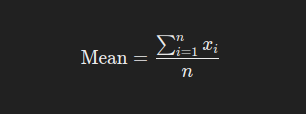
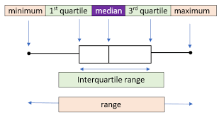
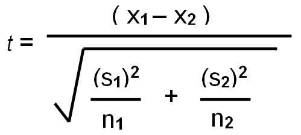

# Statistical Analysis
## Basic Statistical Concepts
### Introduction to Descriptive Statistics

- **Mean, Median and Mode**  

**Mean** is the sum of all values divided by the number of values in the set. It also referred to as average. 
<br> 
**Median** is the middle value when values in a data set is ordered/lined up in ascending/descending order. 
<br>
**Mode** is the number that occurs most in the data set. Simply, the most frequent value in the data set. 

All these, are measures of central tendency. Central tendency identifies the center or typical value of a data set. Measuring central tendency summarizes the data by identifying skewness, distribution and how the data is robust to outliers. Business calculate the central tendencies like average sales, median customer age to make informed decision-making. 


Below is the formula to calculate mean. 



where $x_i$ represents each value in the data set, and $n$ is the number of values. Lets calculate mean of the vector `ages` with the values `12, 58, 27, 33, 31, 27, 37` manually with the steps below;
```
# Add the values together
total_age = 12 + 58 + 27 + 33 + 31 + 27 + 37
total_age # is 225

number_of_values = 7 # there are 7 values 

mean age = total_age/number_of_values
mean_age # is 32.14
```

The average age is 32.14. 

To calculate the median of the vector `ages`, the ages are arranged in descending/ascending order and the middle one is selected. In this case we will line them up in ascending order 

```
# Line the ages up in ascending order 
12, 27, 27, 31, 33, 37, 58

# There are 7 ages, the fourth one from either side is the median value
# The median age is 31
```

To find mode, you just find the value that appears the most, for the values `12, 27, 27 , 31, 33, 37, 58`, age 27 appears twice while these other ages appear once. The value 27 is therefore the mode. 

Mean, median and mode can also be calculated using Base R using the functions `mean()`, `median()` and `mode()` where the vector ages is the argument. 
```{r}
# Create vector ages
ages = c(12, 58, 27, 33, 31, 27, 37)
# Average/mean
mean(ages)

# Median
median(ages)

# Mode
mode(ages)
```

<span style="color: green;">**Practical exercise**</span>

Load the inbuilt `iris` R data set, retrieve the sepal width(`Sepal.Width`) and sepal length(`Sepal.length`) of the each Iris species and store in separate vectors. For instance, the sepal width for *setosa* should be in a variable `setosa.sepal.width`. Finally calculate and interpret the mean, median and mode for each vector

_______________________________________________________________________
<span style="color: brown;">**Solution**</span> 

Get the data 
```{r}
library(dplyr)
data(iris)

# Retrieve the sepal width(Sepal.Width) and sepal length(Sepal.length) of the each Iris species and store in separate vectors.

## Create a function to do this
get_iris_data <- function(x, y){
  selected_iris <- iris %>%
    filter(Species==x) 
  
  as.vector(selected_iris[, "Sepal.Length"])
  }

## Now retrieve the sepal length and width for each species
setosa.sepal.width <- get_iris_data("setosa", "Sepal.Width")
setosa.sepal.length <- get_iris_data("setosa", "Length")

versicolor.sepal.width <- get_iris_data("versicolor", "Sepal.Width")
versicolor.sepal.length <- get_iris_data("versicolor", "Sepal.Length")

virginica.sepal.width <- get_iris_data("virginica", "Sepal.Width")
virginica.sepal.length <- get_iris_data("virginica", "Sepal.Length")
```

Calculate the mean
```{r}
print("MEAN")
print(paste("Setosa Sepal Width:", mean(setosa.sepal.width)))
print(paste("Setosa Sepal Length:", mean(setosa.sepal.length)))
print(paste("Versicolor Sepal Width:", mean(versicolor.sepal.width)))
print(paste("Versicolor Sepal Length:", mean(versicolor.sepal.length)))
print(paste("Virginica Sepal Width:", mean(virginica.sepal.width)))
print(paste("virginica Sepal Length:", mean(virginica.sepal.length)))
```

Calculate median
```{r}
print("MEDIAN")
print(paste("Setosa Sepal Width:", median(setosa.sepal.width)))
print(paste("Setosa Sepal Length:", median(setosa.sepal.length)))
print(paste("Versicolor Sepal Width:", median(versicolor.sepal.width)))
print(paste("Versicolor Sepal Length:", median(versicolor.sepal.length)))
print(paste("Virginica Sepal Width:", median(virginica.sepal.width)))
print(paste("virginica Sepal Length:", median(virginica.sepal.length)))
```

Calculate the mode
```{r}
print("MODE")
print(paste("Setosa Sepal Width:", mode(setosa.sepal.width)))
print(paste("Setosa Sepal Length:", mode(setosa.sepal.length)))
print(paste("Versicolor Sepal Width:", mode(versicolor.sepal.width)))
print(paste("Versicolor Sepal Length:", mode(versicolor.sepal.length)))
print(paste("Virginica Sepal Width:", mode(virginica.sepal.width)))
print(paste("virginica Sepal Length:", mode(virginica.sepal.length)))
```

<span style="color: brown;">**________________________________________________________________________________**</span>


- **Variance and Standard deviation**

Variance is statistical measure of dispersion that defines how spread the data points are in a data set in relation to the mean of the data set. Standard deviation is the measure of how data is clustered around the mean. It is simply defined to as the square root of variance. 

Variance and standard deviation can be calculated in R environment using `var()` and `sd()` functions respectively. 

Lets create a vector of weights of the athletes in kilograms and calculate the variance and standard deviation.

```{r}
# Sample vector 
athlete_weights = c(55, 76, 52, 68, 71, 63, 58, 52, 85, 96)

# Calculate variance
var(athlete_weights)

# Calculate standard deviation
sd(athlete_weights)
```

<span style="color: green;">**Practical exercise**</span>

Using the same iris data set, calculate the variance and standard deviation for the `versicolor` species petal width(`Petal.Width`).

_______________________________________________________________________
<span style="color: brown;">**Solution**</span> 


<span style="color: brown;">**________________________________________________________________________________**</span>


- **Range and Interquartile Range**

**Range** is the difference between the maximum and minimum values in the data set. This defines the spread and dispersion of a data set. 

Below is the formula for Range:

**Range** *=* **Maximum Value** *-* **Minimum Value**

Lets use the weights vector above to calculate the range;

`weights` = `55, 76, 52, 68, 71, 63, 58, 52, 85, 96`

`maximum_weight` = `96`

`minimum_weight` = `52`

`Range = maximum_weight - minimum_weight = 44`

Range is essential in data analysis as it gives a quick sense of variability in the data set, however it vulnerable to outliers since it gives importance to the maximum and minimum values even if they are extreme. 

**Interquartile Range(IQR)** is the difference between the first quartile (Q1) and third quartile(Q3) value. First Quartile is the median of the lower half of the data while Thrid quartile is the median of the upper of the data set. Therefore 

**IQR** *=* **Q3** *-* **Q1**

Lets calculate the IQR of the vector weights step by step;- 

  i. Define the data weights and arrange the data in ascending order. 
`weights = 52, 52, 55, 58, 63, 68, 71, 76, 85, 96`. 
  ii. Determine the first quartile (Q1). Select the lower half(first five values) of the data and find their median which is the first quartile (Q1)

`lower_half = 52, 52, 55, 58, 63`

`Q1 = 55`

iii. Determine the third quartile (Q3). Select the upper half(last five values) and find their median which is the third quartile. 

`upper_half = 68, 71, 76, 85, 96`

`Q3 = 76`

iv. Calculate the Interquartile Range (IQR) by finding the difference between Q1 and Q3. 

`IQR = Q3 - Q1 = 76 - 55 = 21`

The IQR for the weights data set is 21. 


Range and IQR can be calculated in R environment using the `range()` and `IQR()` function respectively. However function range returns the maximum and the minmum values in the dataset. 

```{r}
# Sample vector 
athlete_weights = c(55, 76, 52, 68, 71, 63, 58, 52, 85, 96)
                    
# RANGE 
range(athlete_weights) # returns maximum and minimum values
diff(range(athlete_weights)) # calculate the range value

# INTER QUARTILE RANGE (IQR)http://127.0.0.1:38237/rmd_output/1/basic-data-types-and-structures.html
IQR(athlete_weights)
```

<span style="color: green;">**Practical exercise**</span>

Load the `iris` data set and calculate the range and the Interquartile Range for the Petal Length and petal width for each iris species

### Visualization of Descriptive Statistics
- **Boxplots**

Boxplots provide a visual summary of data distribution. It helps the analyst understand the spread, skewness and outliers in the data set. 



The diagram above shows a labelled boxplot. Lets breakdown each part;

i. **Minimum(Lower Whisker)**: is the smallest data point that appear between the first quartile(Q1) and 1.5x Interquartile Range(IQR) towards the lower limit(left side here. 
ii. **Maximum(Upper Whisker**: is the largest data point that appear between the third quartile(Q3) and 1.5x IQR towards the upper limit(right side here)
iii. **First Quartile(Q1)**: is the 25$^{th}$ percentile  depicting that 25% of the data points are below here. 
iv. **Third Quartile(Q3)**: is the 75$^{th}$ percentile, depicting that 75% of the data points are above here. 
v. **Median(Q2)**: is the 50$^{th}$ percentile that divides the data into two equal halves, 50% of the data points are above and below here. 
vi. **Interquartile Range**: The difference between the third quartile(Q3) and the first quartile(Q1). 
vii. **Outliers**: Data points that fall outside the whiskers are considered as outliers and are plotted as dot alone. 

Lets engage in a practical session and plot a boxplot from the `ggplot`. 

```{r}
library(ggplot2)

# Sample data
set.seed(123) # for reproducibility
df <- data.frame(
  group = rep(c("A", "B", "C"), each = 50),
  value = c(rnorm(50, mean = 10, sd = 2),
            rnorm(50, mean = 15, sd = 2.5),
            rnorm(50, mean = 20, sd = 3))
)

# Create some outliers
outliers <- data.frame(
  group = c(rep("A", 4), rep("B", 4), rep("C", 4)),
  value = c(-2, 3, -30, -35, 50, 6, 45, 50, -17, 8, 60, 65)  # Low and high outliers
)

# Introduce the outliers into the data set 
df_with_outliers <- rbind(df, outliers)


# Plot a simple boxplot 
ggplot(df_with_outliers, aes(x = value)) +
  geom_boxplot(outlier.colour = "red") +
  labs(
    title = "Boxplot of Values",
    x = "Value"
  ) +
  theme_minimal()
```

The red dots are the outliers

<span style="color: green;">**Practical exercise**</span>

Use the `iris` data set to plot boxplots that represent the petal length for each species. Analyze the boxplots and compare them. 

- **Histograms and Density Plots**

These two types of plots are used to visualize the distribution of data. 

A **histogram** is a graphical representation of the distribution of a data set. It divides the data into bins (intervals) and displays the frequency (or count) of data points that fall within each bin. Histograms are particularly useful for:

i. Visualizing the shape of the data distribution: Whether the data is skewed, symmetric, or multimodal.
ii. Identifying outliers: Extreme values that fall far outside the range of most data points.
iii. Understanding the spread: How data points are distributed across the range of values.

Lets plot a simple histogram for this;
```{r}
# Simple Histogram 
ggplot(df_with_outliers, aes(x = value)) +
  geom_histogram(binwidth = 5, fill = "skyblue", color = "black") +
  labs(
    title = "Histogram of Values with Outliers",
    x = "Value",
    y = "Frequency"
  ) +
  theme_minimal()
```
Most values in the data set range between 10 and 20. Let,s also plot the data for a nomal distribution.
```{r}
ggplot(df, aes(x = value)) +
  geom_histogram(binwidth = 5, fill = "skyblue", color = "black") +
  labs(
    title = "Histogram of Values",
    x = "Value",
    y = "Frequency"
  ) +
  theme_minimal()
```

Most of the values are at the center and make a bell-curve.

On the other hand, a **density plot** is a smoothed version of a histogram. It estimates the probability density function of a continuous variable, allowing for a smoother visualization of the distribution. Density plots are particularly useful for:

i. Comparing distributions: Since density plots can overlay multiple distributions, they are helpful in comparing different data sets or groups within a data set.
ii. Visualizing the shape of the data: The smooth curve makes it easier to identify peaks (modes), skewness, and the overall spread.
iii. Understanding the relative likelihood of data: The area under the density curve represents the probability of data falling within a particular range.

Lets plot a density plot and find the visual difference;
```{r}
# Create a density plot
ggplot(df, aes(x = value)) +
  geom_density(fill = "lightgreen", color = "darkgreen", alpha = 0.6) +
  labs(
    title = "Density Plot of Values",
    x = "Value",
    y = "Density"
  ) +
  theme_minimal()
```

From the graphs above, histograms provide a bar-chart-like representation of the data distribution while density plots proved a smoother view of the data distribution. 

<span style="color: green;">**Practical exercise**</span>

Load the `airquality`, an inbuilt R data set. Plot a density plot and histogram separately to visualize the distribution of the speed of wind in mph(`Wind`)

### Hands On Exercise
In this exercise you will use the `"Pima.te"` data set from the MASS package. Follow the steps below to get the data ready and started;

i. Install the `MASS` package by;
```
install.packages("MASS")
```
ii. Import the library
```
library(MASS)
```
iii. Load the pima dataset
```
# Load the data set 
data("Pima.te")

# Show the first few rows of the data 
head(Pima.te)
```

After getting the data ready, apply the skills learnt to;

1. Calculate the destcriptive statistics (mean, mode and median etc)
2. Find the relationship between the plasma glucose concentration in an oral glucose tolerance test(`glu`) and the diastolic blood pressure(`bp`) using a scatter plot
3. Compare the average age of the patients that had diabetes('type`) using a bar chart
4. Find the distribution of age of the patients using a histogram. Explain the distribution. 


## Correlation and Regression Analysis
### Introduction to Correlation 
- **Pearson and Spearman Correlation**

Correlation is the relationship between two variables. It can also defined to as the statistic measure to the degree to which two variables move in relation to each other. 

There are two types of correlation in statistics;- pearson and spearman correlations. They differ in their calculation methods, assumptions and type of relationships they are suited for. 

Pearson correlation measures the linear relationship between two variables with the assumptions that there is a linear relationship between the variables and the data is normally distributed. Contrarily, Spearman correlation measures the monotonic relationship(whether there is a consistent positive or negative change ) between two variables. The data to be analyzed, don't need to be normally distributed, it can be ordinal with the variables having a non-linear relationship. 

Lets take two variables, `X` and `Y`, Pearson correlation is calculated by dividing the covariance of `X` and `Y` with their product of standard deviation. Below is its formula;


`r` is the pearson correlation and it can range from -1 to +1. 

Spearman correlation is calculated by ranking data points, then applying Pearson correlation formula. Below is the formula of spearman correlation;


where; 

  * `d` is the difference between the ranks of corresponding variables
  * `n` is the number of observations
  * `r` is the pearson correlation
  
Spearman correlation is insensitive with outliers because it uses ranks other than outliers. 

<span style="color: green;">**Practical exercise**</span>

Load the `airquality` data set. Calculate the correlation of `Wind` and temperature `Wind`. Interpret the coefficients for various data sets.

- **Visualizing Correlation**

The relationship of exactly two numeric continuous variables can be viewed using scatter plots while the relationship between multiple(two or more) can be analyzed using a correlation plot(heatmap)

```{r}
# Set seed for reproducibility
set.seed(123)

# Create a linear relationship with some noise
x <- rnorm(100, mean = 50, sd = 10)
y <- 2 * x + 5 + rnorm(100, mean = 0, sd = 5)  # Linear relationship with noise

# Combine into a data frame
df <- data.frame(x = x, y = y)


# Create a scatter plot
ggplot(df, aes(x = x, y = y)) +
  geom_point(color = "blue") +
  labs(
    title = "Scatter Plot of X vs Y",
    x = "X Variable",
    y = "Y Variable"
  ) +
  theme_minimal()
```

In the scatter plot above;

i. The `X` and `y` variables have a positive correlation. The increase in `X` leads to an increase in `Y`. 
ii. There are no outliers in the data set. There are no data points that are out of the general pattern.
iii. The relationship between `X` and `Y` is linear.

On the other hand, the heatmap is a visual representation of the correlation matrix where each cell represents the relationship between two variables. The color of the cell indicates the strength of the relationship between the concerned variables. 

Lets create a data frame with multiple variables, and plot a heatmap. 
```{r}
# Set seed for reproducibility
set.seed(123)

# Create 6 variables
var1 <- rnorm(100, mean = 50, sd = 10)
var2 <- rnorm(100, mean = 60, sd = 15)
var3 <- rnorm(100, mean = 70, sd = 20)
var4 <- rnorm(100, mean = 80, sd = 25)
var5 <- 3 * var1 + 7 + rnorm(100, mean = 0, sd = 5)  # Linear relationship with var1
var6 <- rnorm(100, mean = 90, sd = 30)

# Combine into a data frame
df <- data.frame(var1 = var1, var2 = var2, var3 = var3, var4 = var4, var5 = var5, var6 = var6)

# Display the first few rows of the data set
head(df)
```
`var5` has a linear relationship with `var1`. Lets plot a heatmap of the data frame `df`. However, lets install the `ggcorrplot` and the `corrplot` packages
```
install.packages(c("ggcorrplot", "corrplot"))
```

Create a correlation heatmap using the `ggcorrplot` package
```{r}
library(ggcorrplot)

# Calculate the correlation matrix
cor_matrix <- cor(df)

# Create a correlation heatmap
ggcorrplot(cor_matrix, method = "circle", lab = TRUE, lab_size = 3, colors = c("red", "white", "blue")) + 
  labs(title = "Heatmap 1")
```

Lets repeat the same using the `corrplot` package
```{r warning=FALSE, error=FALSE}
library(corrplot)

# Create a correlation heatmap using corrplot
corrplot(cor_matrix, method = "color", type = "upper", tl.col = "black", tl.srt = 45)
```

The two plots visualizes the correlation between the variables in the data set. `Var5` and `Var1` have a high correlation(0.98) while `Var5` and `Var2` have a very low correlation value(-0.07)

<span style="color: green;">**Practical exercise**</span>

Load the same `airquality` inbuilt R data set. Create a scatter plot to show the relationship between `Wind` and `Temp` variable. Also plot a correlation heatmap for numeric data set(`Ozone`, `Solar.R`, `Wind` and `Temp`)

### Introduction to Regression Analysis
Regression is a statistical method used to measure the strength and relationship of a target(dependent) with one or more independent variables. Correlation is very vital in determining regression. Linear regression is the most technique of regression, there are some more advanced forms of regression. 

- **Simple Linear Regression**

This type of regression is used to estimate the relation of one independent variable with the target variable. For instance the relationship between age and height of children. relationship between weight and BMI of athletes, relationship between rainfall and soil erosion. 

When creating a simple linear regression model, a line is fitted a line to the observed data. 

Simple linear regression is modeled by this equation; 

```
y = c + BX + e
```
Where;-

  i. `y` is the target variable
  ii. `X` is the independent variable
  iii. `B` is the slope.gradient(change in `y` for one-unit change in `X`) 
  iv. `c` is the y-intercept(Value of target variable when independent variable is zero)
  v. `e` is the error/noise. variation in `y` but not as a resultant explained by `X`

The goal of simple of linear regression it to have the best fitting line that with the equation `y = BX + c`. Base R has a method of fitting a linear regression and finding the best fit line using `lm()` function. `lm()` stands for "linear model". 

Lets create a simple linear regression model to a hypothetical data set where height of athletes is predicted based on weight. 

```{r}
# Create a sample dataset
height <- c(150, 160, 170, 180, 190)  # Independent variable (x)
weight <- c(65, 70, 75, 80, 85)       # Dependent variable (y)

# Combine into a data frame
data <- data.frame(height, weight)
print(data)

# Fit the linear model
lin_reg <- lm(weight ~ height, data = data)

# View the summary of the model
summary(lin_reg)
```

Coefficients, the value `B` and `c` represent the intercept and the **gradient(slope)** in the equation. The **R- Squared** value indicates how well the independent variable explains the dependent variable. The closer the R-square value to 1 the better the fit. Finally, the **p-value** is associated with the gradient and tells the statistician whether the relationship between the variables is statistically significant. 

<span style="color: green;">**Practical exercise**</span>

Using the `airquality` data set fit a linear regression model to find the relationship between `Wind` (independent variable) and `Temp` (dependent/target variable)

- **Multiple Linear Regression**

Unlike simple linear regression, multiple linear regression describes the linear relationship between two or more independent variables with one target(dependent) variable. The objective of multiple linear regression is to;-

  i. Find the strength of the relationship between two or more independent variables with the target variables. 
  ii. Find the value of the target variable at a certain value of the independent variable. 

When working on a multiple linear regression it is assumed that; the **variance is homogeneous** such that the prediction error does not change significantly across the predictor(independent) variables. It is also assumed, **observations were independent** and there was no hidden relationships among the variables when collecting the data. Additionally, the collected data follows **a normal distribution** and the independent variables have **a linear relationship(linearity)** with the dependent variable, therefore, the line of best fit through the data points is straight and not curved. 

Multiple linear regression is modeled by;-


where;-

  i. $y$ is the predicted value of the target variable. 
  ii. $\beta_0$ is the y-intercept. Value of y when all other parameters are zero. 
  iii. $\beta_1X_1$: $\beta_1$ is the regression coefficient of the first independent variable while $X_1$ is the independent variable value. 
$\cdots$ do the same for however the number of independent variables are present. 
  iv. $\beta_nX_n$: the regression coefficient of the last independent variable. 
  v. $\epsilon$ is the model error(variation not explained by the independent variables)

The Multiple linear regression model calculates three things to find the best fit line for each independent variable;-

i. The regression coefficient $\beta_iX_i$ that will minimize the overall error rate(model error). 
ii. The associated p-value. If the relationship between the independent variable is statistically significant. 
iii. The t-statistic of the model. T-statistic is the ratio of the difference in a number's estimated value from its assumed value to its standard error. 

Lets create a multiple linear regression from a hypothetical data using base R. 

```{r}
# Create a sample dataset
height <- c(150, 160, 170, 180, 190)  # Independent variable 1 (x1)
age <- c(25, 30, 35, 40, 45)          # Independent variable 2 (x2)
weight <- c(65, 70, 75, 80, 85)       # Dependent variable (y)

# Combine into a data frame
data <- data.frame(height, age, weight)
data

# Fit the linear model with multiple predictors
model <- lm(weight ~ height + age, data = data)

# View the summary of the model
summary(model)
```

<span style="color: green;">**Practical exercise**</span>

Using the `airquality` data set, fit a multiple linear regression model whereby the Solar radiation(`Solar.R`), `Ozone` and `Wind` are the independent variables while the Temperature (`Temp`) is the dependent variable. Interpret and analyze the results

### Hands-on Exercises

In this course, you will be required to download the Boston Housing data set from [here](https://www.kaggle.com/datasets/fedesoriano/the-boston-houseprice-data). Fit a multiple regression model to the data set. The goal is to predict the price of the houses in Boston. Interpret and discuss the multiple linear regression model and its implication


## Advanced Statistical Methods
### Introduction to Hypothesis Testing
#### Concept of Hypothesis Testing

Hypothesis testing is a type of statistical analysis that is used to make assumptions of a population based on a sample of data. It is particularly used to find the relationship between two variables(populations). A real life example of hypothesis testing is that a teacher may assume that 60% of the students come from a middle-class family. There are two types of hypothesis; 

  - Null hypothesis($H_0$)
  - Alternate hypothesis ($H_1$ or $H_a$)
  
**Null hypothesis** is states that there is no effect or no difference($\mu = 0$). For instance there is no effect of standards of living to college admissions. **Alternate hypothesis** is the opposite and contradicts the null hypothesis. It provide evidence for what the statistician is trying to find($\mu \neq 0$). In this case, the standards of living have an effect on college admissions.

The important aspects before conducting hypothesis testing are;-

  - *Significance level.* It is the probability of rejecting the null hypothesis when it is actually true. 
  - *P-Value* is the probability of obtaining a test statistic at least as extreme as the one observed, given the null hypothesis is true. Most hypothesis testing projects are set at 0.05. Less than 0.05(or the set value) indicates the null the test is statistically significant and the null hypothesis should be rejected. Otherwise, the test is statistically insignificant and the null hypothesis is not rejected. 
  - *Test statistic* also called T-statistic is a standardized value calcluated during a hypothesis test. It cab z-test or a t-test.
  -*Decision rule* is based on the calculated p-value and the significant level. In a hypothesis test where the significant and the p-value is 0.03444 the null hypothesis is not rejected. 

Now that you are familiar with the hypothesis testing aspects, take the following steps to perform hypothesis testing;- 

  i. Formulating the hypothesis by defining the null and alternate hypothesis.
  ii. Collect and analyze the data. 
  iii. Choose a significant level($a$) and calculate the p-value. 
  iv. Make a decision by comparing the p-value to the significant level.
  v. Conclude your analysis results. 
  
#### T-tests
- *One-Sample t-test*

One sample t-test is a statistical method used to find if the mean of a sample is different from the population(or preassumed) mean. 

It is based on the t-distribution(most observations fall close to the mean, and the rest of the observations make up the tails on either side) and is commonly used when dealing with small sample sizes. One sample t-test is especially performed where the population standard deviation is unknown. 

Below is the formula for one sample t-test
$$t={{\overline{X}-\mu}\over s / \sqrt{n}}$$

where;

i. $t$: the one sample t-test value. t-test statistic
ii. $n$: the number of the observations in the sample
iii. $\overline{X}$: is the sample mean
iv. $s$: standard deviation of the sample 
v. $\mu$: Hypothesized population mean

The result $t$, simply measures how many standard errors the sample mean is away from the hypothesized population mean. 

Before conducting t-test, there is a need to establish the null(H0) and alternate hypothesis(Ha) where;

- *Null Hypothesis(H0)*: There is no significant difference between the sample mean and the population(hypothesized) mean.
- *ALternate Hypothesis(Ha)*: There is a significant difference between the sample mean and the population mean. 

P-value is the probability value that tells you how likely is that your data could have occurred under null hypothesis. In our case a p-value of below  0.05 is considered to be statistically significant and the null value is rejected. The vice versa is true

Lets perform a t-test using R;

We will generate sample data
```{r}
# Set seed for reproducibility
set.seed(123)

# Generate random student marks (out of 100)
student_marks <- rnorm(30, mean = 65, sd = 10)

# Display the first few marks
head(student_marks)
```

Perform the t-test
```{r}
# Conduct one-sample t-test
t_test_result <- t.test(student_marks, mu = 70)

# Display the t-test result
print(t_test_result)
```
<span style="color: green;">**Practical exercise**</span>

Conduct one sample t-test on the sepal length of the setosa iris. The pre-assumed mean is 5.84 units.

- *Two-Sample t-test*

Unlike one sample t-test where a sample population is tested against a pre-assumed mean, the Tow-sample t-test determines if there is a significant difference between the means of two independent populations. 

The practical application of two-sample t-test can be when comparing the test scores of two classes. This helps the statistician to understand if one class did better than the other one or it's just a matter of luck. 

These are the prerequisites before conducting a two-sample t-test; 

i. The groups contain separate data with a similar distribution.
ii. The two populations have a normal(typical bell-curve) distribution.
iii. The two sample populations have a similar variations

The two sample t-test is calculated by;


Where;

- $\overline{x}_1$ and $\overline{x}_2$ are the mean of the first sample and the second sample respectively
- $s_{1}$ and $s_{2}$ are the standard deviation of sample 1 and sample 2 respectively
- $n_1$ and $n_2$ are the sample sizes of the first and second sample respectively. 

Let create a random population of student scores for two classes and perform two-sample t-test in R; 

```{r}
# Generate the population sample
set.seed(123)
group_A_scores <- rnorm(25, mean = 75, sd = 8)  # Group A
group_B_scores <- rnorm(25, mean = 80, sd = 10)  # Group B

# Display the first few scores of each group
head(group_A_scores)
head(group_B_scores)
```

Performing the two sample t-test. Lets set the confidence level to 95%(0.95)
```{r}
ttest_result = t.test(group_A_scores, group_B_scores, 
                      alternative = "two.sided", mu = 0, paired = FALSE,
                      var.equal = FALSE, conf.level = 0.95)

ttest_result
```

* **t-value = -2.6403**: This indicates the difference between the means of the two groups, in terms of standard errors. A higher absolute value suggests a larger difference.
* **Degrees of freedom (df) = 46.312**: This reflects the sample size and variability in the data.
* **p-value = 0.01125**: Since the p-value is less than 0.05, we reject the null hypothesis. This suggests that the difference in means between Group A and Group B is statistically significant.
* **95% confidence interval: (-11.08, -1.50)**: This indicates that we are 95% confident that the true difference in means lies between -11.08 and -1.50.
* **Mean of x (Group A) = 74.73, Mean of y (Group B) = 81.02**: The average score of Group B is higher than Group A.

In summary, the test shows a significant difference between the means of the two groups, with Group B having higher scores


<span style="color: green;">**Practical exercise**</span>

Using the iris data set, compare the petal length of the *versicolor* and *virginica* species using two-sample t-test. Interpret the results

#### ANOVA (Analysis of Variance)
ANOVA is a statistical test used to analyze the difference between the means of more than two groups. This is different from the ttest that analyzes one or two groups, it uses F test to find the statistical significance. Multiple means are compared at once and if one mean is different the hypothesis is rejected. 

The F test compares the variance in each group from the overal group variance. 

An practical example of ANOVA is where a farmer wants to test the effect of three different fertilizers on the crop yield. The difference in the crop yield will be calculated. 

Before conducting ANOVA, the following assumptions are made;

i. **Independence of observations**: the data was collected using statistically valid sampling methods and there are no hidden relationships among the observations. 
ii. **Normal distribution**: the dependent variable should follow a normal distribution.
iii. **Homogeinity of variance**: All the groups being tested should have similar variations. 

Lets calculate the ANOVA using the the crop yield data set. The fertilizer are in three categories; 1, 2 and 3
```{r}
# Load the data set 
crop_df <- read.csv("data/cropdata.csv")
head(crop_df) # view the first few rows of the data set

# Calculate one way ANOVA 
anova <- aov(yield ~ fertilizer, data = crop_df)
anova
```
The ANOVA output provides insights into the variation in crop yield explained by the fertilizer type. Here’s a detailed breakdown of the results:

* **Sum of Squares (fertilizer) = 5.74322**: This value represents the variation in crop yield that can be attributed to the different types of fertilizers used in the experiment. In this case, 5.74322 units of the total variation are explained by fertilizer differences.

* **Sum of Squares (Residuals) = 36.21101**: This is the unexplained variation in crop yield, also known as the error term. This shows how much of the variation is due to factors not accounted for in the model, such as environmental factors or random error.

* **Degrees of Freedom (fertilizer) = 1**: There is only 1 degree of freedom for the fertilizer factor, which means there was a comparison between two groups (likely two fertilizer types or one fertilizer versus a control).

* **Degrees of Freedom (Residuals) = 94**: There are 94 degrees of freedom associated with the residuals. This is related to the total number of observations minus the number of groups being compared. In this case, the large degrees of freedom indicate a sizable data set.

* **Residual Standard Error = 0.6206638**: This value represents the typical deviation of the observed yield values from the predicted values, given the current model. A lower residual standard error suggests a better fit of the model to the data, though this value needs to be interpreted in context.

The results show that the fertilizer type explains some of the variation in crop yield (Sum of Squares = 5.74322), while a larger portion remains unexplained (Sum of Squares of Residuals = 36.21101). To fully interpret the significance of this effect, a p-value and F-statistic would typically be calculated, but these are not provided here. Additionally, the residual standard error (0.6206638) gives an indication of the spread of the data around the predicted values, but more information would be needed to assess the strength of the model’s fit.

In conclusion, while the fertilizer has some effect on crop yield, the overall variability and potential unbalanced data need further exploration for a complete understanding.

<span style="color: green;">**Practical exercise**</span>

Perform ANOVA on the sepal width of the three species in the iris data set and interpret the results. 

#### Chi-Square Test
This is a statistical test that determines the difference between the observed and the expected data. It determines if the relationship between two categorical variables is due to chance or a relationship between them. 

It is calculated by;
$$x_{c}^{2} = \frac{\sum(O_{i}-E_{i})}{E_i}$$

Where; 

i. $c$ is the degree of freedom. This is a statistical calculation that represents the number of variables that can carry and is calculated to ensure the chi-square tests are statistically valid
ii. $O$ is the observed value
iii. $E$ is the expected value

Lets perform Chi-square on a survey data from the `MASS` library. The survey data represents data from a survey conducted on students. 

- Null Hypothesis ($H_0$): The smoking habit is independent of the student's exercise level
- ALternate Hypothesis ($H_a$): The smoking habit is dependent on the exercise level.

Load the data
```{r}
# Load the library
library(MASS)

head(survey) # view the data
```

Create a contigency table between the Smoke and the Exercise leel. 
```{r}
# Create a contingency table with the needed variables.       
stu_data = table(survey$Smoke,survey$Exer) 
                 
print(stu_data)
```

Perform the chi-square test on the `stu_data`, the contigency table.
```{r warning=FALSE}
# applying chisq.test() function
print(chisq.test(stu_data))
```

From the results, the p-value is 0.4828 which is greater than 0.05 therefore the null hypothesis is not rejected. It'c concluded that the smoking habit is independent of the exercise level since there is weak to now correlation between the `Smoke` and `Exer` variables. 

Finally, lets visualize the results from the contigency table;
```{r}
# Visualize the data with a bar plot
barplot(stu_data, beside = TRUE, col = c("lightblue", "lightgreen"),
        main = "Smoking Habits vs Exercise Levels",
        xlab = "Exercise Level", ylab = "Number of Students")
 
# Add legend separately
legend("center", legend = rownames(stu_data), fill = c("lightblue", "lightgreen"))
```

You can see from the table, those students who never smoke lead in every exercise level while the heavy smokers are the least in every group. 

<span style="color: green;">**Practical exercise**</span>

Using the Iris dataset, perform a Chi-square test to determine if there is a relationship between two categorical variables: the species (Species) and a new categorical variable that classifies sepal length (Sepal.Length) into categories (e.g., "Short", "Medium", "Long").

- "Short": below 3.0
- "Medium": above 3.0 to 3.8
- "Long": above 3.8

Follow the steps below;

1. Create a new variable `sepal.Length.Category` in the data set by categorizing the Sepal.Length variable into 3 categories: `"Short"`, `"Medium"`, and `"Long"` (as per the defined ranges).
2. Perform a Chi-square test to see if there's an association between the new `sepal.Length.Category` categories and the `Species` column.
3. Interpret the results of the Chi-square test

### Hands-on Exercises

You are required to download the Groundhog Day Forecasts and Temperatures data set from [here](https://www.kaggle.com/datasets/groundhogclub/groundhog-day).

- Perform one sample t-test on February Average temperature. The pre-assumed mean is 35
- Conduct two sample t-test between the North East average temperature for March and the overall March daily temperature 
- Perform ANOVA between the presence of Punxsutawney Phil and the February average temperature

Interpret the results

## Project: Applying Statistical Analysis 
### Project Overview

The primary goal of this project is to give you an opportunity to apply and integrate all the statistical concepts techniques learned so far using R. The project will guide you through the complete statistical modeling workflow. 

You are therefore required to choose a data set from the list below;

- MBA Admission dataset, Class 2025 - [download here](https://www.kaggle.com/datasets/taweilo/mba-admission-dataset)
- Global Black Money Transactions Dataset - [download here](https://www.kaggle.com/datasets/waqi786/global-black-money-transactions-dataset)
- Crop Yield Prediction Dataset - [download here](https://www.kaggle.com/datasets/mrigaankjaswal/crop-yield-prediction-dataset)
- ChickWeight inbuilt R dataset - load from the command `data("ChickWeight")`
- Seatbelts data set - load from the command `data("Seatbelts")`
- The "Groceries" from the R package  comes  `arules`- Load the data by first importing arules(`library(arules)`) then the data by `data("Groceries")`
- `"CreditCard"` data from package `AER`- Load the data by first importing AER (`library(AER)`) then the data by `data("CreditCard")`

You will use the selected data set to; 

- Identify the research questions that will help focus on what you want to investigate. 
- Determine the key variables in your research questions like the independent and dependent variables.
- Formulate the null and alternate hypothesis 

### Conducting Statistical Analysis

You will use the statistical techniques learned for instance descriptive statistics, correlation, regression and hypothesis testing to analyze this data set 

**Note:** Emphasize on interpreting the results and understanding their implications 

### Presenting Statistical Findings

You will finally prepare a brief presentation that will summarize the statistical analysis and research

Dicuss in groups the insights obtained, challenges faced and any potential improvements