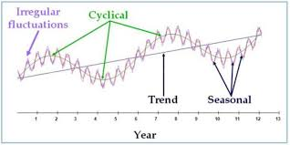

# Time Series Analysis
## Introduction to Time Series Data 
The time series data refers to a sequence of data points collected or recorded at regular time intervals. Each data has a specific time stamps and the data is always dependent on the previous time and after. The order of the rows doesn't matter but the timestamp does, this is what is referred to as **temporal ordering**. Here are some of the distinct characteristics of time series data;

i. *Trend*: the time series data tend to show long-term increase or decrease over a period of time.
ii. *Temporal Dependence*: In time series, the current data values are often influenced by the previous data values and may impact the future ones. 
iii. *Seasonality*: some of the time series data often exhibit repeating patterns at regular intervals for instance daily, monthly and annually.
iv. *Autocorrelation*: current values can be correlated with future or previous time points. 
v. *Stationarity*: Time series is often stationary if its statistical properties for instance mean and variance remain constant over time.

Time series has several applications in the industry, here are some of its applications;

- **Forecasting**; predicting future values based on the previous and current values.
- **Anomaly detection**; identify outliers or any unusual patterns over a certain period of time. 
- **Seasonality**; Find and analyze recurring patterns.
- **Trend Analysis**; Identify trends or patterns over a certain period of time.
- Used in economic and financial analysis to predict economic indicators such as GDP, exchange rates and inflation rates. 
- Measuring natural phenomena like measuring rainfall in weather forecasting.

## Basic Time Series Concepts
- **Components of Time Series**



The above graph represents an example of a time series data. To understand the underlying structure in time series, it is broken down into three components; trend, seasonality and noise. These components characterize the pattern and behavior of data over time. 

1. *Trend*; This will show the general direction of data whether it is upward(increasing) or downward(decreasing). They indicate long-term movement depicting overall growth or decline. The above chart shows that there was an overall growth(upward trend) over the year
2. *Seasonality*; It is the predictable pattern that appear regularly. In the chart above there is a quarterly rise and drop of values.
3. *Cycles*; represents the fluctuations that don't have a fixed period.
4. *Noise*; its is the residual variability of data that has no explanations by the factors affecting the trend. The variability is always small compared to the trend and cycle. 

Lets use the R inbuilt data set, `AirPassengers` to decompose the time series data into trend, seasonality ...
```{r}
# Load the data 
data("AirPassengers")

head(AirPassengers)

# Decompose the air passengers time series 
decomposed_ts <- decompose(AirPassengers)
# Plotting will be done later
# decomposed_ts # uncomment to show the data
```

<span style="color: green;">**Practical exercise**</span>

In this course, you will be required to download the amazon stock prices prediction data set from [here](https://www.kaggle.com/datasets/aenes95/amazon-stock-price-prediction)

_______________________________________________________________________
<span style="color: brown;">**Solution**</span> 

```{r}
library(dplyr)

# Load the data 
amazon_stocks <- read.csv("data/amazon_trends.csv")

# Ensure the data is ordered by date (if necessary)
amazon_stocks <- amazon_stocks %>% arrange(Date)

# Convert to time series object 
ts_data <- ts(amazon_stocks$Google_Trends, frequency = 365)

# Decompose the time series data
decomposed_data <- decompose(ts_data)
```

<span style="color: brown;">**________________________________________________________________________________**</span>

Decompose the time series data set into trend, seasonal and residual components. 

- **Visualization of Time Series Data**

Visualization is a crucial step in the time series analysis process as it enables;

- the researcher to analyze the important concepts in the data such as trend, seasonality and noise
- the analyst to track perfomance over time
- to diagnose alien behaviors like sudden spikes and presence of outliers 
- the analyst to communicate insights to the non-technical stake holders.

Lets visualize the  time series data of the `AirPassengers`. 
```{r}
plot.ts(AirPassengers, 
         main = "AirPasengers Time Series ",
        ylab = "Passengers",
        xlab = "Time",
        col = "blue", 
        lwd = 2)
```

Lets now visualize the decomposed time series. 
```{r}
plot(decomposed_ts)
```

The number of Air Passengers has increased from 1950 to 1960. There is an upward trend. Now lets repeat the process using the `ggplot2` library. 
```{r}
# Load the library
library(ggplot2)

# Convert the air passengers to a dataframe
df_airpassengers <- data.frame(
  # Month = as.Date(time(AirPassengers)),  # Extracting the time component
  Month = seq(from = as.Date("1949-01-31"), to = as.Date("1960-12-31"), by = "month"),
  Passengers = as.numeric(AirPassengers) # Extracting the passenger counts
)

head(df_airpassengers)

# Plot the data
ggplot(df_airpassengers, aes(x = Month, y = Passengers)) +
  geom_line(color = "blue", size = 1) +         # Line for the time series data
  labs(title = "Air Passengers Time Series Data",       # Title
       x = "Month",                              # X-axis label
       y = "Passengers") +                           # Y-axis label
  theme_minimal()                               # Apply a minimal theme
```

Now lets visualize the decomposed time series (`AirPassengers`) data using the `ggplot2` library;

- create a data frame from the decomposed data 
```{r}
# Create a data frame with all the components
df_decomposed <- data.frame(
  Date = seq(from = as.Date("1949-01-31"), to = as.Date("1960-12-31"), by = "month"), 
  Observed = as.numeric(AirPassengers),
  Trend = as.numeric(decomposed_ts$trend),
  Seasonal = as.numeric(decomposed_ts$seasonal),
  Residual = as.numeric(decomposed_ts$random)
)

# Remove the null values 
df_decomposed <- na.omit(df_decomposed)

head(df_decomposed)
```

<span style="color: green;">**Practical exercise**</span>

Using the amazon stock prices prediction data set, plot the data to identify time series patterns and trends

_______________________________________________________________________
<span style="color: brown;">**Solution**</span> 

```{r}
library(dplyr)

# Load the data 
amazon_stocks <- read.csv("data/amazon_trends.csv")

# Ensure the data is ordered by date (if necessary)
amazon_stocks <- amazon_stocks %>% arrange(Date)

# Convert to time series object 
ts_data <- ts(amazon_stocks$Google_Trends, frequency = 365)

# Decompose the time series data
decomposed_data <- decompose(ts_data)

# Plot the decomposed data
plot(decomposed_data)
```
<span style="color: brown;">**________________________________________________________________________________**</span>

## Basic Time Series Forecasting 
### Moving Averages

Moving average is a statistical calculations used to analyze values over a specific period of time. Its main focus is to smooth out the short term fluctuations that makes it easier to identify the underlying trends in the data. It smoothens the time series data by averaging the the values over a sliding window. 

There are two types of Moving Averages, namely;

i. Simple Moving Averages(SMA)
ii. Weighted Moving Averages (WMA)

Moving Average can also be referred to as the **rolling mean**. In this course we will demonstrate how to calculate and plot the Simple Moving Average using the `rollmean()` and `filter()` functions from the `zoo` and the Base R respectively. 

- Load the required libraries 
```{r, echo=TRUE, message=FALSE, warning=FALSE}
# Load the libraries 
library(ggplot2) # for plotting 
library(zoo) # to access `rollmean` function
```

- Load the data and calulate the moving average using the `rollmean()` function. Since the data was collected in monthly basis, a yearly moving average will be calculated. 
```{r warning=FALSE}
# Load the AirPassengers dataset
data("AirPassengers")

# Calculate 12-month moving average using rollmean() from zoo package
moving_avg <- rollmean(AirPassengers, 
                       k = 12, # 12- Month Moving Average
                       fill = NA) 

# Create a data frame combining the original data and moving average
df_airpassengers <- data.frame(
  Month = as.Date(time(AirPassengers)),
  Passengers = as.numeric(AirPassengers),
  MovingAvg = as.numeric(moving_avg)
)

# View the first few rows of the data frame
head(df_airpassengers, 10)
```

- Now plot the time series data along with the moving average
```{r}
# Plot original data and moving average
ggplot(df_airpassengers, aes(x = Month)) + 
  geom_line(aes(y = Passengers), color = "blue", size = 1) +  # Original data
  geom_line(aes(y = MovingAvg), color = "red", size = 1.2) +  # Moving average
  labs(title = "AirPassengers - Moving Average (12 months)",
       y = "Number of Passengers", x = "Month") +
  theme_minimal()
```

* *The blue line represents the original time series data*

* *The red line represents the Moving Average data*, you can see that the line is smoother. 

- Let's repeat the process but this time we use the `filter()` function from the Base R. Remember `dplyr` also has `filter()` function. To speficify use `stats::filter()`. 
```{r warning=FALSE}
# Calculate the Moving Average
moving_avg_filter <- stats::filter(AirPassengers, rep(1/12, 12), sides = 2)

# Add the moving average to the existing data frame
df_airpassengers$MovingAvg_Filter <- as.numeric(moving_avg_filter)

# Plot original data and moving average calculated by filter()
ggplot(df_airpassengers, aes(x = Month)) + 
  geom_line(aes(y = Passengers), color = "blue", size = 1) +  # Original data
  geom_line(aes(y = MovingAvg_Filter), color = "green", size = 1.2) +  # Moving average from filter
  labs(title = "AirPassengers - Moving Average (12 months, filter())",
       y = "Number of Passengers", x = "Month") +
  theme_minimal()

```

* *The green line represents the simple moving average over a 12-month sliding window*

<span style="color: green;">**Practical exercise**</span>

Apply 30-day moving averages on the amazon stock.

_______________________________________________________________________
<span style="color: brown;">**Solution**</span> 

```{r}
library(dplyr)
library(zoo)
library(ggplot2)

# Load the data 
amazon_stocks <- read.csv("data/amazon_trends.csv")

# Ensure the data is ordered by date (if necessary)
amazon_stocks <- amazon_stocks %>% arrange(Date)

# Calculate 30-day moving average (approximate for monthly)
amazon_stocks <- amazon_stocks %>%
  mutate(moving_avg_30 = rollmean(Google_Trends, k = 30, fill = NA))

# Plot the original data and moving average
ggplot(amazon_stocks, aes(x = Date)) +
  geom_line(aes(y = Google_Trends, color = "Original"), size = 1) + 
  geom_line(aes(y = moving_avg_30, color = "30-Day Moving Avg"), size = 1) +
  labs(title = "Stock Price with 30-Day Moving Average",
       x = "Date", y = "Stock Price") +
  scale_color_manual(values = c("Original" = "blue", "30-Day Moving Avg" = "red")) +
  theme_minimal() +
  theme(legend.title = element_blank())
```

**Work on it later- Copy the guide**

<span style="color: brown;">**________________________________________________________________________________**</span>

### ARIMA model 
**ARIMA** stands for *AutoRegressive Integrated Moving Average* that is defined in three parameters namely; p, d and q where;

i. **AR(p) Autoregression**: This utilizes the relationship between the current values and the previous one where the current ones are dependent on the previous. 
ii. **I(d) Integration**: It entails subtracting the current observations of a series with its previous values `d` number of times. This is done to make the time series stationary. 
iii. **MA(q) Moving Average**: A model that uses the dependency between an observation and a residual error from a moving average model applied to lagged observations. A moving average component depicts the error of the model as a combination of previous error terms. The order q represents the number of terms to be included in the model

In summary, `p`, `d` and `q` represents the number of autoregressive (AR) terms, the number of differences required to make the series stationary and the number of moving averages(MA) respectively. These values are determined using the following diagonstic tools;

i. **Autocorrelation Function(ACF)**: identifies the MA terms 
ii. **Partial Autocorrelation Function (PACF)**: identifies the number of AR terms.
iii. **Differencing**: determines the value of `d` need to make the series stationary. 

R has `auto.arima()` function from the `forecast` library designed to create the ARIMA model. 
The `forecast` library can be installed by;
```
install.packages("forecast")
```

Lets use the `AirPassengers` data to design our ARIMA model. 

**Step 1**: Check stationarity

To create an ARIMA model the time series data, in this case the `AirPassengers`, must be stationary i.e have a constant mean and variance. Otherwise, differencing is applied to make it stationary. The `diff()` is used to this. 
```{r}
# Load necessary library
library(forecast)

# Load the AirPassengers data set if not loaded already

# Make the data stationary by differencing
diff_passengers <- diff(log(AirPassengers))
```

**Step 2**: Use the ACF and PACF Plots to Identify ARIMA Parameters

- The **ACF** is used to find the correlation between the time series and the lagged versions((previous) of itself. Thats the `q` (MA) parameter.

- The **PACF** finds the correlation between the time series and the lagged versions of itself but after removing the effect of the intermediate lags. Thats the `p` (AR) parameter

**Step 3**: Plot the ACF and PACF

The `acf()` and `pacf` functions are used to generate the plots.
```{r}
# Plot the ACF and PACF of the differenced data
par(mfrow = c(1, 2))  # Set up for side-by-side plots

# ACF plot
acf(diff_passengers, main = "ACF of Differenced AirPassengers")

```
```{r}
# PACF plot
pacf(diff_passengers, main = "PACF of Differenced AirPassengers")
```

<-**Interpret the plots**->

The `AirPassengers` data set is not stationary, therefore the data will be transformed by log-transform before applying differencing
```{r}
# Log transformation to stabilize variance
log_passengers <- log(AirPassengers)

# Difference the log-transformed data to make it stationary
diff_passengers <- diff(log_passengers)

# Plot the differenced series to check stationarity
plot(diff_passengers, main = "Differenced Log of AirPassengers", ylab = "Differenced Log(Passengers)", xlab = "Time")

```

**Step 4**: Fit the ARIMA model

The `auto.arima()` function can be used to automate the process of selecting the `p`, `d`, `q` parameters. 
```{r}
# Auto-identify ARIMA parameters and fit the model
fit_arima <- auto.arima(log_passengers)

# Display the summary of the fitted ARIMA model
summary(fit_arima)
```

Lets fit the ARIMA model with of order `1 1 1` to represent `p d q` respectively. 
```{r}
# Fit ARIMA(1,1,1) model
fit_manual_arima <- arima(log_passengers, order = c(1, 1, 1))

# Display the summary of the fitted ARIMA model
summary(fit_manual_arima)
```

**Step 5**: Forecast with the ARIMA model

The fitted ARIMA model can now be used for forecasting the future values using the `arima()` function. 
```{r}
# Forecast for the next 24 months (2 years)
forecast_arima <- forecast(fit_arima, h = 24)

# Plot the forecast
plot(forecast_arima, main = "ARIMA Forecast for AirPassengers", xlab = "Time", ylab = "Log(Passengers)")
```

The blue part of the plot represents the forecasted values. 

<span style="color: green;">**Practical exercise**</span>

Fit the ARIMA model to the Amazon Stock Prices Prediction data and interpret the results. 


## Hands-On Exercises 

You will be required to download the Electricity Price & Demand 2018-2023 data set from [here](https://www.kaggle.com/datasets/joebeachcapital/nsw-australia-electricity-demand-2018-2023/data)

Perform time series on the total demand on one of the csv files provided from visualization to forecasting