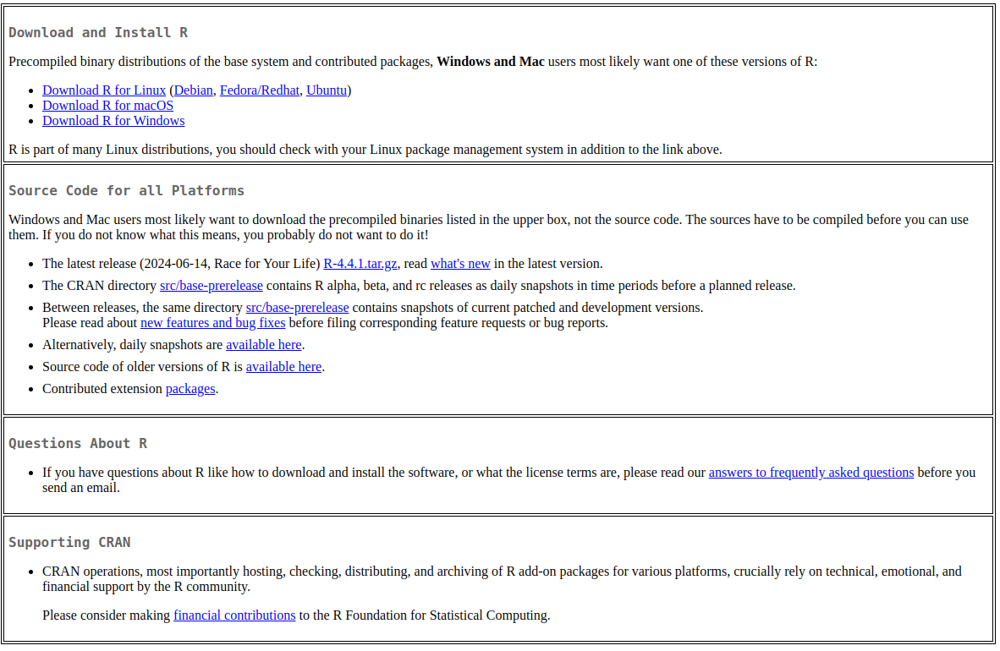

--- 
title: "R Course"
author: "YOUR NAME HERE"
date: "`r Sys.Date()`"
site: bookdown::bookdown_site
---
# Introduction to R and Basic Programming Concepts
## Overview of R Programming

### Introduction to R


R is a programming language particularly designed for statistics and data analysis. It was invented the statisticians Robert Gentleman and Ross Ihaka in 1990 and now its the one of the most widely used in data science community. The language is open-source, this has allowed extensive customization and adaptability for research and data analysis. Here are some of the Key features of R;

1. **Statistical Computing**: R has various tools specifically for statistics like time-series, clustering, classification ,and linear and non-linear models. 
2. **Data Wrangling and Analysis**: R has extensive libraries like `dplyr` and `ggplot` for data manipulation and visualizations respectively. Users are able to clean, transform and present the data inform of charts in a meaningful way for better insights with the help of these libraries.
3. **Reproducibility**: R language  allows reproducible research such that the code and the results can be stored inform of scripts, markdown, notebooks and bookdown. Work done in R can be easily shared and reviewed enabling easy collaboration and transparency in work. 
4. **Comprehensive Ecosystem**: R has the CRAN(Comprehensive R Archive Network) that hosts numerous packages for different tasks like machine learning, data visualization, finances, bioinformatics and more. 
5. **Versatility**: R can be used with other tools like other programming languages, for instance Python, SQL etc. This allows seamless integration in the wide range of data ecosystems. 

### Importance of R in Data Analysis
This are some of the features that sets R apart in the data community; 

- **Large Community and Support**: There is a large online community for data scientist and other researchers who use R. The community has contributed to the development of various packages , continuous improvements, support and extensive documentation. This has made it possible and easy for new users and experienced users to find solution for the complex tasks. 
- **Versatility**: Data Analysis in R is applicable in various industries like health, finance, government and academia. This allows it to handle diverse data types and analysis needs. 
- **Specialization on Statistical Analysis**: Most programming languages were designed to be general purpose but R was designed specifically for statistics. This ensures its users have access to the most relevant and important tools in the data analysis tasks. 
- **Advanced Visualization**: R has one of the best visualization capabilities like dashboards apps, interactive charts. Also, it can be used to generate the most aesthetically pleasing chart crucial for effective communication and decision making. 

### Application of R in Various Industries
R is widely applicable in various industries due to its robust statistical capabilities, open source nature and the extensive library how is important in different industries;

- R is the go-to tool in the field of academia and research especially in data analysis, social and environmental science research(psychology, economics and climate change), reproducible research and statistical research. 
- In the Manufacturing industries, R can be used to optimize operations like supply chain, quality control and cost reduction.
- The Governments can use R for data driven research like demographics, economic policy analysis, health and social policy.Forecasts can be made using R that will enable the research. 
- The finance and banking industries use R for complex tasks like algorithmic trading, portfolio optimization, credit scoring and risk management. 
- R is applicable is essential in the health industry in areas like clinical trials and bioinformatics, tracking the spread of diseases(epidemiology) and help in health policy making. 

R is also applicable in many other industries like marketing, sports and entertainment to name but a few. As industries continue to embrace data-driven strategies, R's role in analytics and decision-making will only continue to grow.

## Introduction to the R ecosystem
### R Studio
**Rstudio** is an integrated development environment(IDE) for R. 

It includes a console, syntax-highlighting editor that supports direct code execution as well as tools for plotting history, debugging and work space management. 

R studio is an open source software from posit and can be freely be downloaded from https://posit.co/download/rstudio-desktop/. This link has all the installation files for Mac, Linux and Windows. You will download the installation file and install based on your computer operating system. 

### CRAN 
**CRAN** in full is Comprehensive R Archive Network that is a central repository for R and its packages. It stores a collection R function data and compiled code. It is an essential part in R and acts as a hub due to the open source nature of R. It supports the growth and adoption of R by making powerful tools easily accessible to users and developers alike. The CRAN repo can be accessed [here](https://cran.r-project.org/). 

## Setting Up R Environment 
### Installation of R and RStudio
Follow the steps below to download and install R;

i. Visit [here](https://cran.r-project.org/) to visit the CRAN web interface. 
ii. Download the precompiled binaries according to your computer operating system

iii. If you are using linux(Debian/Ubuntu) run the below command to install R on the terminal. 
```
sudo apt update
sudo apt upgrade
sudo apt install r-base
```

iv. Open the downloaded R file and follow instructions to install R on Mac and Window. 
v. After installing R on Mac, run the below command on terminal to verify its installation. 
```
R
```
vi. `q()` to quit the R console on the terminal. 

The process of R studio installation is essentially the same as R;-

i. Visit the R studio [downloads](https://posit.co/download/rstudio-desktop/#download) page to download R according to your computer's operating system. 
ii. For linux, move the downloaded file to the `home/<user>` directory and open the terminal. 
iii. Run `sudo dpkg -i rstudio-1.2.5033-amd64.deb` to install RStudio. Remember to replace the `rstudio-1.2.5033-amd64.deb` with the downloaded filepath. 
iv. On Windows and Mac, open the downloaded the downloaded file, open it and follow the instructions to install it. 
v. Open the RStudio and DO YOUR MAGIC!!!

### Introduction to RStudio Interface


The image above is for R code in R Studio. Each quadrant has its own function. 

1. **text editor**: serves as the primary interface for writing and editing R scripts, Markdown documents, and other text-based files
2. **stand input/output (console/terminal/jobs)**: It is the bottom left quadrant in R Studio that serves as a command-line interface where you can directly interact with R such as code execution and output display.
3. **all data and its properties quadrants**: It is the top right quadrant in Rstudio that is typically the "Environment" pane, which provides information and tools for managing your R environment such as data importation, display of variables. 
4. **plots and file directory structure**: The bottom right quadrant in RStudio typically houses the "Files", "Plots", "Packages", "Help", and "Viewer" tabs. 

### Basic R Syntax and Commands
R syntax has specific rules that govern how code is written in R. Understanding these concepts makes a programmer to write clear and error-free code. These are some of the syntax rules that govern how code is written in R. 

1. **Case sensitivity**  
The R syntax distinguishes between the uppercase letter and the lowercase letter. A variable written in uppercase is different as the variable written in lowercase even the words mean the same. For instance let's take the variable "age" and store it `15`, and another variable "AGE" and store it `27` and see their outputs.

```{r warning=FALSE}
# Different variables due to case sensitivity
age <- 15
AGE <- 27

print(age)  # Outputs: 15
print(AGE)  # Outputs: 27
```

You can see that above here the variable `age` and `AGE` are treated as different.

2. **Assignment Operators**  
R has several different methods to assign a value to a variable. They include;

i. **Equal Sign('=')**: This assignment operator is always used when assigning the function arguments but can used in general assignments.
  
```{r}
age = 21 #variable `age` is assigned to 21
```
ii. **Left Arrow('<-')**: This is the common type of assignment operator. The direction of the arrow points to the variable 

```{r}
age <- 10 # variable 'age' assigned to 10
```
iii. **Right Arrow('->')**: This is just like the right arrow operator however the direction of the arrow is reversed. The arrow should still point to the direction of the variable. 
```{r}
27 -> age # arrow points to the direction of the variable, age
```

3. **Use of symbols**  
The R language has several symbols that have specific meaning important when writing code.
    
  i. **The Hash('#')**: Is used for comments. R ignores any text that follows `#` in the same line 
```{r}
# This is a comment
```
  ii. **Dollar Sign ('$`)**: Used to access elements of a list or column values in a data frame 
```{r}
df <- data.frame(a = 1:3, b = 4:6)
df$a  # Accesses column 'a' in the data frame
```
  iii. **Square brackets (`[]`)**: They are used for indexing vectors, lists, matrices and data frames 
```{r}
v <- c(10, 20, 30)
v[3]  # Accesses the third element (20)

```
  iv. **Curly braces (`{}`)**: Used to group multiple expressions, for instance in loops and conditional statements. In this case we will use a if else conditional statement to show how curly braces are used
```{r}
x <- 2
if (x > 0) {
  print("Positive number")
}
```
  iv. **Left arrow ('<-') and the right arrow ('->')**: As mentioned earlier, these are assignment operators
  v. **Brackets '()'**: Used for function calls and grouping expressions 
```{r}
sum(1, 2, 3)
```

There are more symbols used in R especially in mathematical operators and advanced concepts that will be later introduced in the course. 

3. **Reserved Words**  
R has set of reserved words that have special meaning like identifiers and function names. These words cannot be used as variable names. if, else, repeat, while, function, TRUE, FALSE, NA and NULL are just but a few examples of reserved words. 

4. **Whitespace**  
R generally ignores whitespace (spaces, tabs, newlines) between elements, except within character strings or where it would change the meaning of the code. Proper use of whitespace improves code readability.
```{r}
x <-  5 +  3  # Valid
y <-5+3       # Also valid, but less readable
```

## Hands-on Exercise
1. Solve the following equations;

    a. `34 + 54`
    b. `76 - 10`
    c. `25 * 25`
    
2. Assign variable `d` and `f` to values `42` and `14` respectively and solve `d/f`

_______________________________________________________________________
## <span style="color: brown;">Solution</span> 

1. Solve the following equations;

    a. `34 + 54`
    b. `76 - 10`
    c. `25 * 25`
    
```{r}
# a. `34 + 54`
34 + 54

# b. `76 - 10`
76-10

# c. `25 * 25`
25 * 25
```

2. Assign variable `d` and `f` to values `42` and `14` respectively and solve `d/f`

```{r}
# Assign variables
d <- 42
f <- 14 

# solve d/f 
d/f
```

<span style="color: brown;">**________________________________________________________________________________**</span>